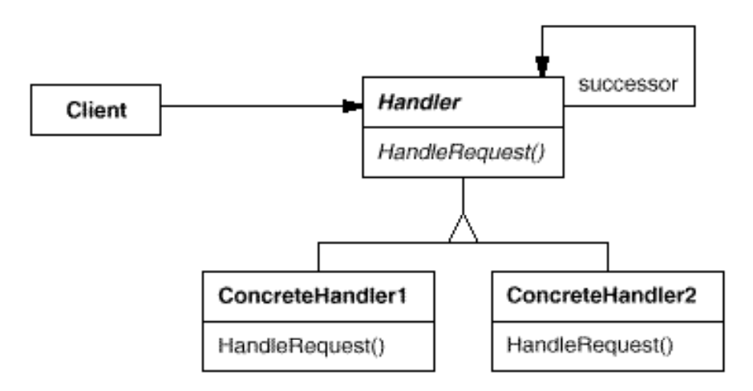

# CHAIN OF RESPONSIBILITY
## Propósito:
Permite que você passe pedidos por uma corrente de handlers. Ao receber um pedido, cada handler decide se processa o pedido ou o passa adiante para o próximo handler na corrente.
Cada objeto receptor possui uma lógica descrevendo os tipos de solicitação que é capaz de processar e como passar adiante aquelas que requeiram processamento por outros receptores. A delegação das solicitações pode formar uma árvore de recursão, com um mecanismo especial para inserção de novos receptores no final da cadeia existente.
## Intenção:
Evitar o acoplamento do remetente de uma solicitação ao seu receptor, ao dar a mais de um objeto a oportunidade de tratar a solicitação. Encadear os objetos receptores, passando a solicitação ao longo da cadeia até que um objeto a trate.
Uma maneira de passar uma requisição entre uma cadeia de objetos.
## Problema: 
Ao escrever um aplicativo de qualquer tipo, geralmente acontece que o evento gerado por um objeto precisa ser tratado por outro. E, para tornar nosso trabalho ainda mais difícil, também temos acesso negado ao objeto que precisa lidar com o evento.
## Solução:
Permite que um objeto envie um comando sem saber qual objeto receberá e manipulará. A solicitação é enviada de um objeto para outro, tornando-os partes de uma cadeia e cada objeto dessa cadeia pode manipular o comando, transmiti-lo ou fazer os dois.
Se baseia em transformar certos comportamentos em objetos solitários chamados handlers.O padrão sugere que você ligue esses handlers em uma corrente. Cada handler ligado tem um campo para armazenar uma referência ao próximo handler da corrente. Além de processar o pedido, handlers o passam adiante na corrente. O pedido viaja através da corrente até que todos os handlers tiveram uma chance de processá-lo.
## Aplicabilidade: 
Utilize o padrão Chain of Responsibility quando é esperado que seu programa processe diferentes tipos de pedidos em várias maneiras, mas os exatos tipos de pedidos e suas sequências são desconhecidos de antemão.
O padrão permite que você ligue vários handlers em uma corrente e, ao receber um pedido, perguntar para cada handler se ele pode ou não processá-lo. Dessa forma todos os handlers tem a chance de processar o pedido.

Utilize o padrão quando é essencial executar diversos handlers em uma ordem específica.
Já que você pode ligar os handlers em uma corrente em qualquer ordem, todos os pedidos irão atravessar a corrente exatamente como você planejou.

Utilize o padrão CoR quando o conjunto de handlers e suas encomendas devem mudar no momento de execução.
Se você providenciar setters para um campo de referência dentro das classes handler, você será capaz de inserir, remover, ou reordenar os handlers de forma dinâmica.

## Prós:
Você pode controlar a ordem de tratamento dos pedidos.
Princípio de responsabilidade única. Você pode desacoplar classes que invocam operações de classes que realizam operações.
Princípio aberto/fechado. Você pode introduzir novos manipuladores no aplicativo sem quebrar o código do cliente existente.
## Contras:
Alguns pedidos podem acabar sem tratamento.
## Como implementar:
1 - Declare a interface do handler e descreva a assinatura de um método para lidar com pedidos.Decida como o cliente irá passar os dados do pedido para o método. A maneira mais flexível é converter o pedido em um objeto e passá-lo para o método handler como um argumento.
2 - Para eliminar código padrão duplicado nos handlers concretos, pode valer a pena criar uma classe handler base abstrata, derivada da interface do handler. Essa classe deve ter um campo para armazenar uma referência ao próximo handler na corrente. Considere tornar a classe imutável. Contudo, se você planeja modificar correntes no tempo de execução, você precisa definir um setter para alterar o valor do campo de referência.
3 - Crie subclasses handler concretas e implemente seus métodos handler. Cada handler deve fazer duas decisões ao receber um pedido:
 * Se ele vai processar o pedido.
 * Se ele vai passar o pedido adiante na corrente.

4 - O cliente pode tanto montar correntes sozinho ou receber correntes pré construídas de outros objetos. Neste último caso, você deve implementar algumas classes fábrica para construir correntes de acordo com a configuração ou definições de ambiente.

## Relações com outros padrões

O __Chain of Responsibility__ é frequentemente usado em conjunto com o __Composite__. Neste caso, quando um componente folha recebe um pedido, ele pode passá-lo através de uma corrente de todos os componentes pai até a raiz do objeto árvore.
