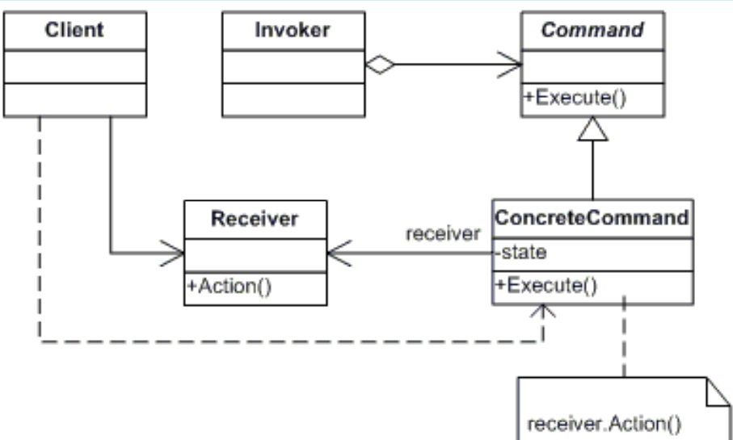

# COMMAND
## Propósito:
Transforma um pedido em um objeto independente que contém toda a informação sobre o pedido. Essa transformação permite que você parametrize métodos com diferentes pedidos, atrase ou coloque a execução do pedido em uma fila, e suporte operações que não podem ser feitas.
Nesse padrão, uma solicitação é agrupada em um objeto como um comando e passada para o objeto invocador. O objeto invocador passa o comando para o objeto apropriado que pode manipulá-lo e esse objeto executa o comando. Isso lida com a solicitação de maneiras tradicionais, como enfileiramento e retornos de chamada.
## Intenção:
Encapsular uma solicitação como um objeto, desta forma permitindo parametrizar clientes com diferente solicitações, enfileirar ou fazer o registro (log) de solicitações e suportar operações que podem ser desfeitas.
Encapsular comandos como um objeto.
## Problema: 
É necessário emitir solicitações para objetos sem saber nada sobre a operação que está sendo solicitada ou o destinatário da solicitação.
## Solução:
Desacopla o objeto que chama a operação daquele que sabe como executá-la. Para conseguir essa separação, o designer cria uma classe base abstrata que mapeia um receiver (um objeto) com uma ação (um ponteiro para uma função de um membro). A classe base contém um método Execute() que simplesmente chama a ação no “receiver”.

Todos os clientes dos objetos Command tratam cada objeto como uma “caixa preta”, simplesmente invocando o método virtual Execute() sempre que o cliente exigir o “serviço” do objeto.
## Aplicabilidade: 
Utilize o padrão Command necessidade de implementar funcionalidades de callback.

Utilize o padrão Command precisa suportar a funcionalidade Refazer e Desfazer para comandos.

Utilize o padrão Command necessidade de auditoria e registro de todas as alterações por meio de comandos.

Utilize o padrão Command quando você quer parametrizar objetos com operações.O padrão Command podem tornar uma chamada específica para um método em um objeto separado. Essa mudança abre várias possibilidades de usos interessantes: você pode passar comandos como argumentos do método, armazená-los dentro de outros objetos, trocar comandos ligados no momento de execução, etc.

Utilize o padrão Command quando você quer colocar operações em fila, agendar sua execução, ou executá-las remotamente. Como qualquer outro objeto, um comando pode ser serializado, o que significa convertê-lo em uma string que pode ser facilmente escrita em um arquivo ou base de dados. Mais tarde a string pode ser restaurada no objeto comando inicial. Dessa forma você pode adiar e agendar execuções do comando. Mas isso não é tudo! Da mesma forma, você pode colocar em fila, fazer registro de log ou enviar comandos por uma rede.

## Prós:
Princípio de responsabilidade única . Você pode desacoplar classes que invocam operações de classes que executam essas operações.
Princípio Aberto / Fechado . Você pode introduzir novos comandos no aplicativo sem quebrar o código do cliente existente.
Você pode implementar desfazer / refazer.
Você pode implementar a execução adiada de operações.
Você pode montar um conjunto de comandos simples em um complexo.
## Contras:
O código pode se tornar mais complicado, pois você está introduzindo uma nova camada entre remetentes e receptores/destinatários.
## Como implementar:
1 - Declare a interface comando com um único método de execução.
2 - Comece extraindo pedidos para dentro de classes concretas comando que implementam a interface comando. Cada classe deve ter um conjunto de campos para armazenar os argumentos dos pedidos junto com uma referência ao objeto destinatário real. Todos esses valores devem ser inicializados através do construtor do comando.
3 - Adicione os campos para armazenar comandos nessas classes. Remetentes devem sempre comunicar-se com seus comandos através da interface comando.
4 - Mude os remetentes para que executem o comando ao invés de enviar o pedido para o destinatário diretamente.

## Relações com outros padrões

Handlers em uma __Chain of Responsibility__ podem ser implementados como __comandos__. Neste caso, você pode executar várias operações diferentes sobre o mesmo objeto contexto, representado por um pedido.

Você pode usar o __Command__ e o __Memento__ juntos quando implementando um “desfazer”. Neste caso, os comandos são responsáveis pela realização de várias operações sobre um objeto alvo, enquanto que os mementos salvam o estado daquele objeto momentos antes de um comando ser executado.