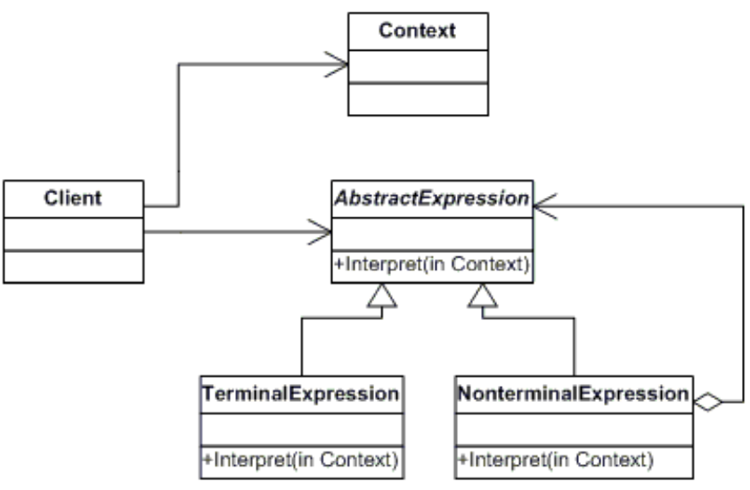

# INTERPRETER
## Propósito:
Avalia/interpreta as instruções escritas em uma gramática ou notações de idiomas. Esse padrão envolve a implementação de uma interface de expressão que informa para interpretar um contexto específico. Esse padrão é usado nos compiladores ou analisadores ou expansões de macro.
## Intenção:
Dada uma linguagem, definir uma representação para a sua gramática juntamente com um interpretador que usa representação para interpretar sentenças da linguagem.
– Uma forma de incluir elementos da linguagem em um programa.
– Usa classes para representar cada regra de uma gramática (expressão regular).
## Problema: 
Uma classe de problemas ocorre repetidamente em um domínio bem definido e bem entendido. Se o domínio fosse caracterizado com uma “linguagem”, os problemas poderiam ser facilmente resolvidos com um “mecanismo” de interpretação.
## Solução:
O padrão Interpreter discute: definir uma linguagem de domínio (ou seja, caracterização do problema) como uma gramática simples, representando regras de domínio como sentenças de linguagem e interpretar essas sentenças para resolver o problema. O padrão usa uma classe para representar cada regra gramatical. E como as gramáticas geralmente têm uma estrutura hierárquica, uma hierarquia de herança de classes de regra é bem mapeada.
## Aplicabilidade: 
Utilize o padrão quando precisa interpretar uma gramática que pode ser representada como grandes árvores de sintaxe.

## Prós:
Considerado em sua forma mais geral (isto é, uma operação distribuída por uma hierarquia de classes com base no padrão Composto), quase todo uso do padrão Composto também conterá o padrão Interpreter. Mas o padrão Interpreter deve ser reservado para os casos em que você deseja pensar nessa hierarquia de classes como definindo um idioma.
## Contras:
O padrão não aborda a análise. Quando a gramática é muito complexa, outras técnicas (como um state) são mais apropriadas.
## Como implementar:
1 - Cria uma classe contexto onde contem unformações de entrada saida.
2-  Cria uma classe cliente onde cria a árvore de sintaxe abstrata para um conjunto de instruções na gramática especificada. Essa árvore é criada com a ajuda de instâncias de classes.
3- Crie uma interface onde define a operação Interpretar, que deve ser implementada por cada subclasse.
4- Crie as classes onde ira implementar a interface onde sera usada na classe cliente.

## Relações com outros padrões

