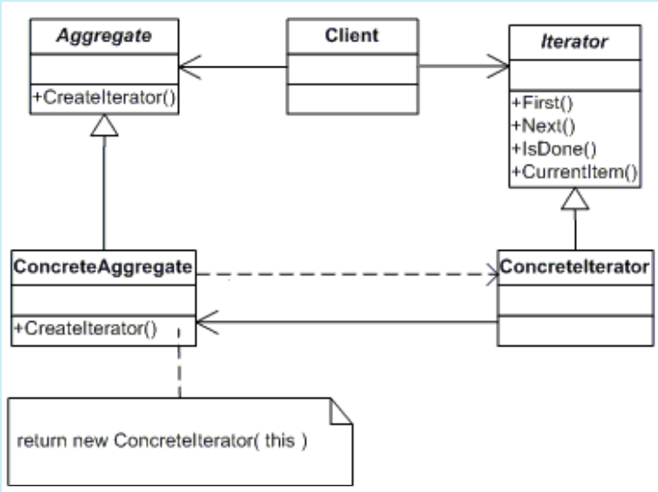

# ITERATOR
## Propósito:
Permitir a você percorrer elementos de uma coleção sem expor as representações dele (lista, pilha, árvore, etc.)
## Intenção:
Fornecer um meio de acessar, sequencialmente, os elementos de um objeto agregado sem expor a sua representação.
## Problema: 
É necessário “abstrair” a travessia de estruturas de dados totalmente diferentes, para que sejam definidos algoritmos capazes de interagir com cada um de forma transparente.
A maioria das coleções armazena seus elementos em listas simples. Contudo, alguns deles são baseados em pilhas, árvores, grafos, e outras estruturas complexas de dados.Mas independente de quão complexa uma coleção é estruturada, ela deve fornecer uma maneira de acessar seus elementos para que outro código possa usá-los. Deve haver uma maneira de ir de elemento em elemento na coleção sem ter que acessar os mesmos elementos repetidamente.
## Solução:
A ideia principal do padrão Iterator é extrair o comportamento de travessia de uma coleção para um objeto separado chamado um iterador.
Além de implementar o algoritmo em si, um objeto iterador encapsula todos os detalhes da travessia, tais como a posição atual e quantos elementos faltam para chegar ao fim. Por causa disso, alguns iteradores podem averiguar a mesma coleção ao mesmo tempo, independentemente um do outro.
Todos os iteradores devem implementar a mesma interface. Isso torna o código do cliente compatível com qualquer tipo de coleção ou algoritmo transversal, desde que haja um iterador adequado.

## Aplicabilidade: 
Utilize o padrão Iterator quando permite acessar os elementos de um objeto de coleção de forma sequencial sem conhecer sua estrutura subjacente.

Utilize o padrão Iterator quando precisar de iterações múltiplas ou simultâneas são necessárias sobre os elementos das coleções.

Utilize o padrão Iterator para fornece uma interface uniforme para acessar os elementos da coleção.

Utilize o padrão Iterator quando sua coleção tiver uma estrutura de dados complexa por debaixo dos panos, mas você quer esconder a complexidade dela de seus clientes (seja por motivos de conveniência ou segurança).O iterador encapsula os detalhes de se trabalhar com uma estrutura de dados complexa, fornecendo ao cliente vários métodos simples para acessar os elementos da coleção. Embora essa abordagem seja muito conveniente para o cliente, ela também protege a coleção de ações descuidadas ou maliciosas que o cliente poderia fazer se estivesse trabalhando com as coleções diretamente.

Utilize o padrão para reduzir a duplicação de código de travessia em sua aplicação. O código de algoritmos de iteração não triviais tendem a ser muito pesados. Quando colocados dentro da lógica de negócio da aplicação, ele pode desfocar a responsabilidade do codigo original e torná-lo um código de difícil manutenção. Mover o código de travessia para os iteradores designados pode ajudar você a tornar o código da aplicação mais enxuto e limpo.

Utilize o Iterator quando você quer que seu código seja capaz de percorrer diferentes estruturas de dados ou quando os tipos dessas estruturas são desconhecidos de antemão. O padrão fornece um par de interfaces genérica tanto para coleções como para iteradores. Já que seu código agora usa essas interfaces, ele ainda vai funcionar se você passar diversos tipos de coleções e iteradores que implementam essas interfaces.

## Prós:
Princípio de responsabilidade única . Você pode limpar o código do cliente e as coleções extraindo algoritmos volumosos volumosos em classes separadas.
Princípio Aberto / Fechado . Você pode implementar novos tipos de coleções e iteradores e passá-los para o código existente sem quebrar nada.
Você pode iterar sobre a mesma coleção em paralelo porque cada objeto iterador contém seu próprio estado de iteração.
Pelo mesmo motivo, você pode atrasar uma iteração e continuar quando necessário.
## Contras:
A aplicação do padrão pode ser um exagero se o aplicativo funcionar apenas com coleções simples.
O uso de um iterador pode ser menos eficiente do que passar diretamente pelos elementos de algumas coleções especializadas.

## Como implementar:
1 - Declare a interface do iterador. Ao mínimo, ela deve ter um método para buscar o próximo elemento de uma coleção. Mas por motivos de conveniência você pode adicionar alguns outros métodos, tais como recuperar o elemento anterior, saber a posição atual, e checar o fim da iteração.

2 - Declare a interface da coleção e descreva um método para buscar iteradores. O tipo de retorno deve ser igual à interface do iterador. Você pode declarar métodos parecidos se você planeja ter grupos distintos de iteradores.

3- Implemente classes iterador concretas para as coleções que você quer percorrer com iteradores. Um objeto iterador deve ser ligado com uma única instância de coleção. Geralmente esse link é estabelecido através do construtor do iterador.

4 - Implemente a interface da coleção na suas classes de coleção. A ideia principal é fornecer ao cliente com um atalho para criar iteradores, customizados para uma classe coleção em particular. O objeto da coleção deve passar a si mesmo para o construtor do iterador para estabelecer um link entre eles.

5- Vá até o código cliente e substitua todo o código de travessia de coleção com pelo uso de iteradores. O cliente busca um novo objeto iterador a cada vez que precisa iterar sobre os elementos de uma coleção.
## Relações com outros padrões

Você pode usar __Iteradores__ para percorrer árvores __Composite__.

Você pode usar o __Memento__ junto com o __Iterator__ para capturar o estado de iteração atual e revertê-lo se necessário.

Você pode usar o __Visitor__ junto com o __Iterator__ para percorrer uma estrutura de dados complexas e executar alguma operação sobre seus elementos, mesmo se eles todos tenham classes diferentes.

Você pode usar o __Factory Method__ junto com o __Iterator__ para permitir que uma coleção de subclasses retornem diferentes tipos de iteradores que são compatíveis com as coleções.
