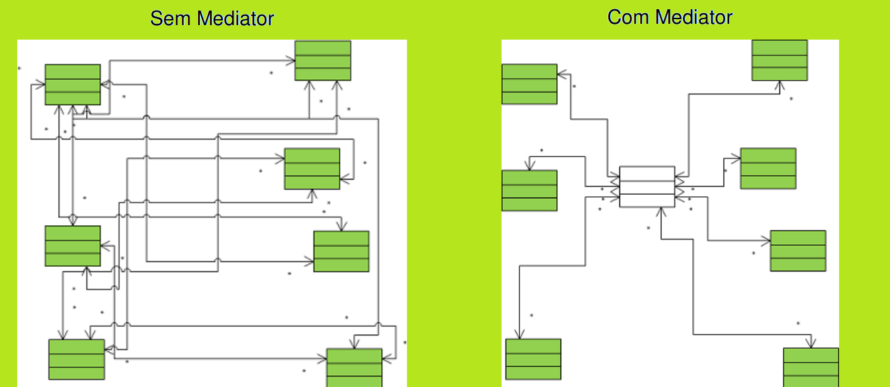
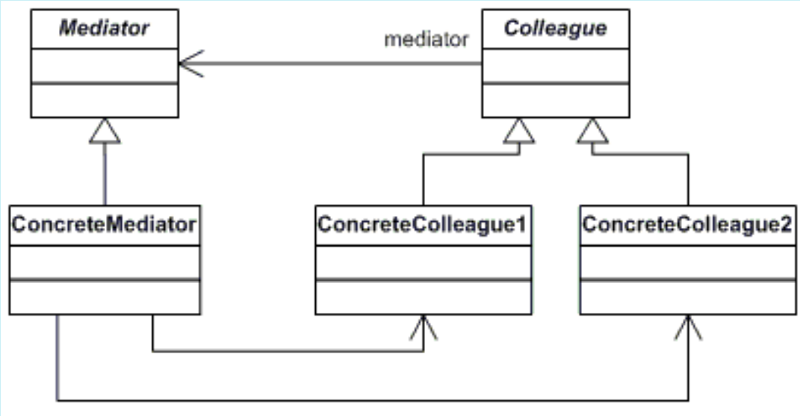

# MEDIATOR
## Propósito:
Permite reduzir dependências caóticas entre objetos. O padrão restringe as comunicações diretas entre os objetos e os força a colaborar apenas por meio de um objeto mediador.

## Intenção:
Definir um objeto que encapsula a forma como um conjunto de objetos interage O Mediator promove o acoplamento fraco ao evitar que os objetos se refiram uns aos outros explicitamente e permite variar suas interações independentemente.
Definir uma comunicação simplificada entre as classes.
## Problema: 
Queremos projetar componentes reutilizáveis, mas as dependências entre as peças potencialmente reutilizáveis, porém os mesmo se tornam aclopados e resulta em um conjunto de tudo ou nada.
## Solução:
sugere que você interrompa toda a comunicação direta entre os componentes que deseja tornar independentes um do outro.Alterando eles para uma colaboração indireta, ou seja chamando um objeto mediador especial onde ira direcionar as chamadas para componente apropriado. Ficando os componentes dependentes apenas de uma única classe de mediador em vez de ser aclopado a varias classes.
## Aplicabilidade: 
Utilize o padrão Mediator quando é difícil mudar algumas das classes porque elas estão firmemente acopladas a várias outras classes. O padrão lhe permite extrair todas as relações entre classes para uma classe separada, isolando quaisquer mudanças para um componente específico do resto dos componentes.

Utilize o padrão quando você não pode reutilizar um componente em um programa diferente porque ele é muito dependente de outros componentes. Após você aplicar o Mediator, componentes individuais se tornam alheios aos outros componentes. Eles ainda podem se comunicar entre si, mas de forma indireta, através do objeto mediador. Para reutilizar um componente em uma aplicação diferente, você precisa fornecer a ele uma nova classe mediadora.

Utilize o Mediator quando você se encontrar criando um monte de subclasses para componentes apenas para reutilizar algum comportamento básico em vários contextos. Como todas as relações entre componentes estão contidas dentro do mediador, é fácil definir novas maneiras para esses componentes colaborarem introduzindo novas classes mediadoras, sem ter que mudar os próprios componentes.

## Prós:
Princípio de responsabilidade única. Você pode extrair as comunicações entre vários componentes para um único lugar, tornando as de mais fácil entendimento e manutenção.
Princípio aberto/fechado. Você pode introduzir novos mediadores sem ter que mudar os próprios componentes.
Você pode reduzir o acoplamento entre os vários componentes de um programa.
Você pode reutilizar componentes individuais mais facilmente.
## Contras:
Com o tempo, um mediator pode evoluir para um Objeto Indispensavel.
## Como implementar:
1 -Identifique um grupo de classes firmemente acopladas que se beneficiariam de estar mais independentes
2- Crie uma interface Mediador que define as operações que podem ser chamadas pelos objetos colegas para comunicação.
3- Crie uma classe concreta que implementa as operações de comunicação da interface mediador.
4- Crie uma classe que define um unico campo protegido que mantém uma referência a um mediador.A conexão é geralmente estabelecida no construtor do componente, onde o objeto mediador é passado como um argumento.
5- Crie as classes que se comunique com o mediador.Extraia o código que envolve chamar os outros componentes para a classe do mediador. 
## Relações com outros padrões
