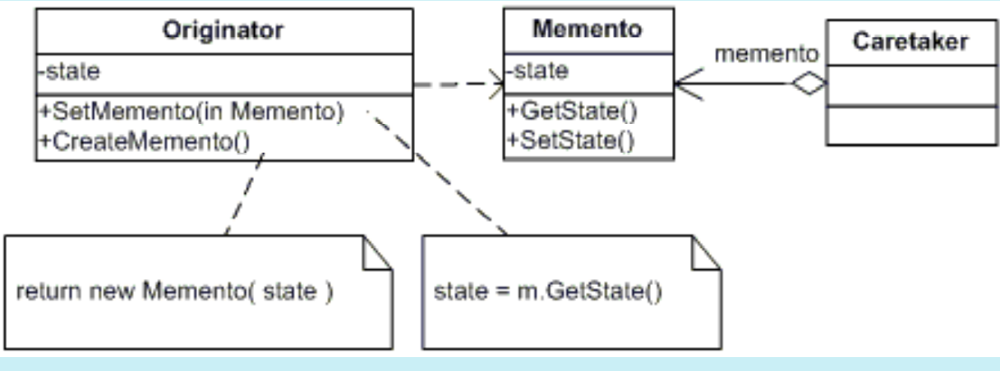

# MEMENTO
## Propósito:
Permite que você salve e restaure o estado anterior de um objeto sem revelar os detalhes de sua implementação.
## Intenção:
Sem violar o encapsulamento, capturar e externalizar um estado interno de um objeto, de maneira que o objeto possa ser restaurado para este estado mais tarde.
## Problema: 
Em determinado momento você decide permitir que os usuários desfaçam/restaurem quaisquer operações realizadas no texto (por exemplo, operações “desfazer” ou “reverter”).
## Solução:
O padrão sugere armazenar a cópia do estado de um objeto em um objeto especial chamado memento.O conteudo deste objeto criado sendo acessivel apenas para aquele que produziu o conteudo, os outros podem se comunicar acessando uma interface limitada que pode permitir a recuperação dos metadados do retrato (data de criação, nome a operação efetuada, etc.), mas não ao estado do objeto original contido no retrato.
O originador tem acesso total ao memento, enquanto que o cuidador pode acessar somente os metadados.Tal regra restritiva permite que você armazene mementos dentro de outros objetos, geralmente chamados de cuidadores. Uma vez que o cuidador trabalha com o memento apenas por meio de uma interface limitada, ele não será capaz de mexer com o estado armazenado dentro do memento. Ao mesmo tempo, o originador tem acesso total a todos os campos dentro do memento, permitindo que ele o restaure ao seu estado anterior à vontade.

## Aplicabilidade: 
Utilize o padrão Memento quando você quer produzir retratos do estado de um objeto para ser capaz de restaurar um estado anterior do objeto.O padrão Memento permite que você faça cópias completas do estado de um objeto, incluindo campos privados, e armazená-los separadamente do objeto. Embora a maioria das pessoas vão lembrar desse padrão graças ao caso “desfazer”, ele também é indispensável quando se está lidando com transações (isto é, se você precisa reverter uma operação quando se depara com um erro).

 Utilize o padrão quando o acesso direto para os campos/getters/setters de um objeto viola seu encapsulamento. O Memento faz o próprio objeto ser responsável por criar um retrato de seu estado. Nenhum outro objeto pode ler o retrato, fazendo do estado original do objeto algo seguro e confiável.

## Prós:
Você pode produzir instantâneos do estado do objeto sem violar seu encapsulamento.
Você pode simplificar o código do autor, deixando o responsável manter o histórico do estado do autor.
## Contras:
O aplicativo pode consumir muita RAM se os clientes criarem mementos com muita frequência.
Os responsáveis ​​devem acompanhar o ciclo de vida do remetente para poder destruir mementos obsoletos.
## Como implementar:
1- Crie uma classe Originador que cria um objeto de lembrança
2- Crie uma interface Memento que contem as abstrações para a implementação
3- Adicione um método para produção de mementos na classe originadora. A originadora deve passar seu estado para o memento através de um ou múltiplos argumentos do construtor do memento.
4- Adicione um método para restaurar o estado da classe originadora para sua classe. Ele deve aceitar o objeto memento como um parametro. 
5- A cuidadora, estando ela representando um objeto comando, um histórico, ou algo completamente diferente, deve saber quando pedir novos mementos da originadora, como armazená-los, e quando restaurar a originadora com um memento em particular.
6- O elo entre cuidadoras e originadoras deve ser movido para dentro da classe memento. Neste caso, cada memento deve se conectar com a originadora que criou ele. O método de restauração também deve ser movido para a classe memento. 
## Relações com outros padrões

Você pode usar o __Memento__ junto com o __Iterator__ para capturar o estado de iteração atual e revertê-lo se necessário.

Você pode usar o __Command__ e o __Memento__ juntos quando implementando um “desfazer”. Neste caso, os comandos são responsáveis pela realização de várias operações sobre um objeto alvo, enquanto que os mementos salvam o estado daquele objeto momentos antes de um comando ser executado.