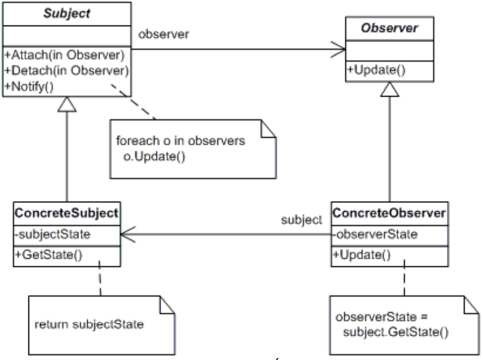

# OBSERVER
## Propósito:
É um padrão de design comportamental que permite definir um mecanismo de assinatura para notificar vários objetos sobre quaisquer eventos que ocorram no objeto que estão observando.
## Intenção:
Definir uma dependência um-para-muitos entre objetos, de maneira que quando um objeto muda de estado todos os seus dependentes são notificados e atualizados automaticamente.

## Problema: 
Um grande projeto monolítico não se adapta bem à medida que novos requisitos de gráficos ou monitoramento são cobrados.
## Solução:
O padrão Observer sugere que você adicione um mecanismo de assinatura para a classe publicadora para que objetos individuais possam assinar ou desassinar uma corrente de eventos vindo daquela publicadora. 
O objeto que tem um estado interessante é quase sempre chamado de sujeito, mas já que ele também vai notificar outros objetos sobre as mudanças em seu estado, nós vamos chamá-lo de publicador. Todos os outros objetos que querem saber das mudanças do estado do publicador são chamados de assinantes.
## Aplicabilidade: 
Utilize o padrão Observer quando mudanças no estado de um objeto podem precisar mudar outros objetos, e o atual conjunto de objetos é desconhecido de antemão ou muda dinamicamente.O padrão Observer permite que qualquer objeto que implemente a interface do assinante possa se inscrever para notificações de eventos em objetos da publicadora. Você pode adicionar o mecanismo de inscrição em seus botões, permitindo que o cliente coloque seu próprio código através de classes assinantes customizadas.

Utilize o padrão quando alguns objetos em sua aplicação devem observar outros, mas apenas por um tempo limitado ou em casos específicos. A lista de inscrição é dinâmica, então assinantes podem entrar e sair da lista sempre que quiserem.

## Prós:
Princípio aberto/fechado. Você pode introduzir novas classes assinantes sem ter que mudar o código da publicadora (e vice versa se existe uma interface publicadora).
Você pode estabelecer relações entre objetos durante a execução.
## Contras:
Assinantes são notificados em ordem aleatória

## Como implementar:
1- Crie a interface do assinante, ela deve conter um único método atualizar
2- Crie a interface da publicadora e descreva os de métodos para adicionar um objeto assinante , removê-lo da lista e notificar. 
3- Crie as classes publicadoras concretas. A cada vez que algo importante acontece dentro de uma publicadora, ela deve notificar seus assinantes.
4- Implemente os métodos de notificação de atualização nas classes assinantes concretas. A maioria dos assinantes precisarão de dados contextuais sobre o evento. Eles podem ser passados como argumentos do método de notificação.
5- O cliente deve criar todas os assinantes necessários e registrá-los com suas publicadoras apropriadas.
## Relações com outros padrões

