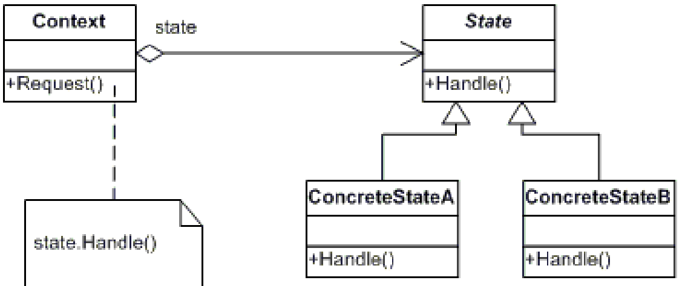

# STATE
## Propósito:
Alterar o comportamento de um objeto quando seu estado muda.
## Intenção:
Permite a um objeto alterar seu comportamento quando o seu estado interno muda. O objeto parecerá ter mudado sua classe.

## Problema: 
Existe um número finito de estados nos quais um programa pode estar. Dentro de qualquer estado único, o programa se comporta de maneira diferente e o programa pode ser alternado de um estado para outro instantaneamente. No entanto, dependendo do estado atual, o programa pode ou não mudar para outros estados. Essas regras de comutação, chamadas transições , também são finitas e predeterminadas.
## Solução:
O padrão State sugere que você crie novas classes para todos os estados possíveis de um objeto e extraia todos os comportamentos específicos de estados para dentro dessas classes.Ao invés de implementar todos os comportamentos por conta própria, o objeto original, chamado contexto, armazena uma referência para um dos objetos de estado que representa seu estado atual, e delega todo o trabalho relacionado aos estados para aquele objeto.
## Aplicabilidade: 
Utilize o padrão State quando você tem um objeto que se comporta de maneira diferente dependendo do seu estado atual, quando o número de estados é enorme, e quando o código estado específico muda com frequência. O padrão sugere que você extraia todo o código estado específico para um conjunto de classes distintas. Como resultado, você pode adicionar novos estados ou mudar os existentes independentemente uns dos outros, reduzindo o custo da manutenção.

Utilize o padrão quando você tem uma classe populada com condicionais gigantes que alteram como a classe se comporta de acordo com os valores atuais dos campos da classe. O padrão State permite que você extraia ramificações dessas condicionais para dentro de métodos de classes correspondentes. Ao fazer isso, você também limpa para fora da classe principal os campos temporários e os métodos auxiliares envolvidos no código estado específico.

Utilize o State quando você tem muito código duplicado em muitos estados parecidos e transições de uma máquina de estado baseada em condições.
 O padrão State permite que você componha hierarquias de classes estado e reduza a duplicação ao extrair código comum para dentro de classes abstratas base.

## Prós:
Princípio de responsabilidade única . Organize o código relacionado a estados específicos em classes separadas.
Princípio Aberto / Fechado . Introduzir novos estados sem alterar as classes de estado existentes ou o contexto.
Simplifique o código do contexto, eliminando condicionais volumosos da máquina de estado.
## Contras:
A aplicação do padrão pode ser um exagero se uma máquina de estados tiver apenas alguns estados ou raramente mudar.
## Como implementar:
1- Crie a interface do estado ficando apenas aqueles que possam conter comportamento específico ao estado.
2- Para cada estado real, crie uma classe que deriva da interface do estado.
3- Crie uma classe contexto, adicione um campo de referência do tipo de interface do estado e um setter público que permite sobrescrever o valor daquele campo.
4- Para trocar o estado do contexto, crie uma instância de uma das classes estado e a passe para o contexto. 

## Relações com outros padrões

O __State__ pode ser considerado como uma extensão do __Strategy__. Ambos padrões são baseados em composição: eles mudam o comportamento do contexto ao delegar algum trabalho para objetos auxiliares. 

