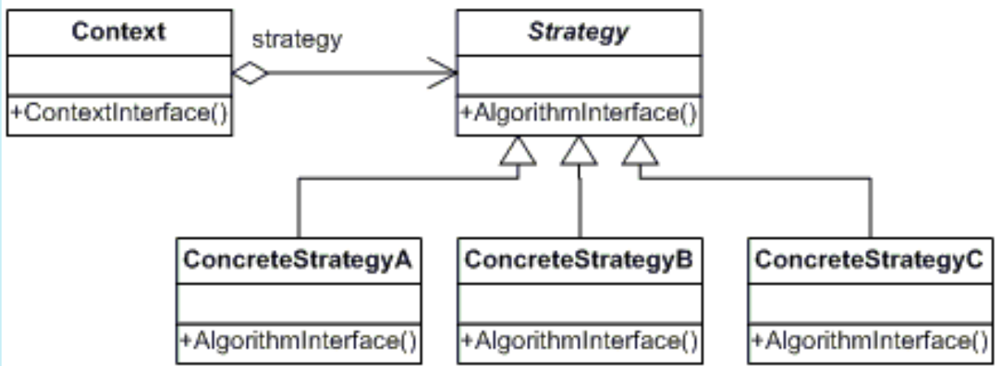

# STRATEGY
## Propósito:
Encapsular algoritmos (“estratégias”) como um objeto.
## Intenção:
Definir uma família de algoritmos, encapsular cada uma delas e torná-las intercambiáveis. Strategy permite que o algoritmo varie independentemente dos clientes que o utilizam.

## Problema: 
O problema principal que o strategy tenta resolver, é diminuir o acoplamento entre classes bases de classes derivadas.
Com isso ele acaba indo de encontro a um dos princípios do solid “principle open-closed”.

## Solução:
O padrão Strategy sugere que você pegue uma classe que faz algo específico em diversas maneiras diferentes e extraia todos esses algoritmos para classes separadas chamadas estratégias.
Encapsule detalhes da interface em uma classe base e oculte detalhes da implementação em classes derivadas. Os clientss podem, então, se acoplar a uma interface e não precisam se modificados: com isso, nosso client não sofreria nenhum impacto quando o número de classes derivadas é alterado e nenhum impacto quando a implementação de uma classe derivada é alterada.
## Aplicabilidade: 
Utilize o padrão Strategy quando você quer usar diferentes variantes de um algoritmo dentro de um objeto e ser capaz de trocar de um algoritmo para outro durante a execução. O padrão Strategy permite que você altere indiretamente o comportamento de um objeto durante a execução ao associá-lo com diferentes sub-objetos que pode fazer sub-tarefas específicas em diferentes formas.

Utilize o Strategy quando você tem muitas classes parecidas que somente diferem na forma que elas executam algum comportamento. O padrão Strategy permite que você extraia o comportamento variante para uma hierarquia de classe separada e combine as classes originais em uma, portando reduzindo código duplicado.

Utilize o padrão para isolar a lógica do negócio de uma classe dos detalhes de implementação de algoritmos que podem não ser tão importantes no contexto da lógica. O padrão Strategy permite que você isole o código, dados internos, e dependências de vários algoritmos do restante do código. Vários clientes podem obter uma simples interface para executar os algoritmos e trocá-los durante a execução do programa.

Utilize o padrão quando sua classe tem um operador condicional muito grande que troca entre diferentes variantes do mesmo algoritmo. O padrão Strategy permite que você se livre dessa condicional ao extrair todos os algoritmos para classes separadas, todos eles implementando a mesma interface. O objeto original delega a execução de um desses objetos, ao invés de implementar todas as variantes do algoritmo.

## Prós:
Você pode trocar algoritmos usados ​​dentro de um objeto em tempo de execução.
Você pode isolar os detalhes de implementação de um algoritmo do código que o utiliza.
Você pode substituir herança por composição.
Princípio Aberto / Fechado . Você pode introduzir novas estratégias sem precisar alterar o contexto.
## Contras:
Se você possui apenas alguns algoritmos e eles raramente mudam, não há motivo real para complicar demais o programa com novas classes e interfaces que acompanham o padrão.
Os clientes devem estar cientes das diferenças entre as estratégias para poder selecionar uma adequada.

## Como implementar:
1- Crie a interface da Strategy  comum para todas as variantes do algoritmo, ela será usada pelo objeto Context para chamar o algoritmo definido por uma ConcreteStrategy.
2- Crie classe contexto, adicione um campo para armazenar uma referência a um objeto Strategy . Forneça um setter para substituir valores daquele campo. O contexto deve trabalhar com o objeto Strategy  somente através da interface Strategy . O contexto pode definir uma interface que deixa a estratégia acessar seus dados.
3- Crie as classes concretas, elas implementam a interface da Strategy.
4- Os Clientes do contexto devem associá-lo com uma estratégia apropriada que coincide com a maneira que esperam que o contexto atue em seu trabalho primário. 
## Relações com outros padrões
O __State__ pode ser considerado como uma extensão do __Strategy__. Ambos padrões são baseados em composição: eles mudam o comportamento do contexto ao delegar algum trabalho para objetos auxiliares
