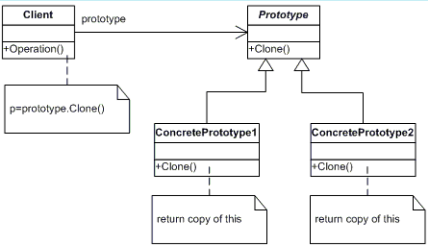

# PROTOTYPE

## Propósito:

O Prototype é um padrão de projeto criacional que permite copiar objetos existentes sem fazer seu código ficar dependente de suas classes.

## Intenção:

Especificar os tipos de objetos a serem criados usando uma instância protótipo e criar novos objetos pela cópia deste protótipo.
Uma instância inicializada a ser copiada ou clonada.

## Problema: 

Digamos que você tenha um objeto, e você quer criar uma cópia exata dele. Como você o faria? Primeiro, você tem que criar um novo objeto da mesma classe. Então você terá que ir por todos os campos do objeto original e copiar seus valores para o novo objeto.Mas tem uma pegadinha. Nem todos os objetos podem ser copiados dessa forma porque alguns campos de objeto podem ser privados e não serão visíveis fora do próprio objeto.

Há ainda mais um problema com a abordagem direta. Uma vez que você precisa saber a classe do objeto para criar uma cópia, seu código se torna dependente daquela classe. Se a dependência adicional não te assusta, tem ainda outra pegadinha. Algumas vezes você só sabe a interface que o objeto segue, mas não sua classe concreta, quando, por exemplo, um parâmetro em um método aceita quaisquer objetos que seguem uma interface.

## Solução:

O padrão Prototype delega o processo de clonagem para o próprio objeto que está sendo clonado. O padrão declara um interface comum para todos os objetos que suportam clonagem. Essa interface permite que você clone um objeto sem acoplar seu código à classe daquele objeto. Geralmente, tal interface contém apenas um único método clonar.

O método cria um objeto da classe atual e carrega todos os valores de campo para do antigo objeto para o novo. Você pode até mesmo copiar campos privados porque a maioria das linguagens de programação permite objetos acessar campos privados de outros objetos que pertençam a mesma classe.

## Aplicabilidade:

#### Utilize o padrão Prototype quando seu código não deve depender de classes concretas de objetos que você precisa copiar.

Isso acontece muito quando seu código funciona com objetos passados para você de um código de terceiros através de alguma interface. As classes concretas desses objetos são desconhecidas, e você não pode depender delas mesmo que quisesse.

O padrão Prototype fornece o código cliente com uma interface geral para trabalhar com todos os objetos que suportam clonagem. Essa interface faz o código do cliente ser independente das classes concretas dos objetos que ele clona.

#### Utilize o padrão quando você precisa reduzir o número de subclasses que somente diferem na forma que inicializam seus respectivos objetos. Alguém pode ter criado essas subclasses para ser capaz de criar objetos com uma configuração específica.

O padrão Prototype permite que você use um conjunto de objetos pré construídos, configurados de diversas formas, como protótipos.

Ao invés de instanciar uma subclasse que coincide com alguma configuração, o cliente pode simplesmente procurar por um protótipo apropriado e cloná-lo

## Prós:

* Você pode clonar objetos sem acoplá-los a suas classes concretas.
* Você pode se livrar de códigos de inicialização repetidos em troca de clonar protótipos pré-construídos.
* Você pode produzir objetos complexos mais convenientemente.
* Você tem uma alternativa para herança quando lidar com configurações pré determinadas para objetos complexos.

## Contras:

* Clonar objetos complexos que têm referências circulares pode ser bem complicado.

## Como implementar:

Crie uma interface protótipo e declare o método clonar nela. Ou apenas adicione o método para todas as classes de uma hierarquia de classes existente, se você tiver uma.

Uma classe protótipo deve definir o construtor alternativo que aceita um objeto daquela classe como um argumento. O construtor deve copiar os valores de todos os campos definidos na classe do objeto passado para a nova instância recém criada. Se você está mudando uma subclasse, você deve chamar o construtor da classe pai para permitir que a superclasse lide com a clonagem de seus campos privados.

Se a sua linguagem de programação não suporta sobrecarregamento de métodos, você pode definir um método especial para copiar os dados do objeto. O construtor é um local mais conveniente para se fazer isso porque ele entrega o objeto resultante logo depois que você chamar o operador new.

O método de clonagem geralmente consiste em apenas uma linha: executando um operador new com a versão protótipo do construtor. Observe que toda classe deve explicitamente sobrescrever o método de clonagem and usar sua própria classe junto com o operador new. Do contrário, o método de clonagem pode produzir um objeto da classe superior.

Opcionalmente, crie um registro protótipo centralizado para armazenar um catálogo de protótipos usados com frequência.

Você pode implementar o registro como uma nova classe factory ou colocá-lo na classe protótipo base com um método estático para recuperar o protótipo. Esse método deve procurar por um protótipo baseado em critérios de busca que o código cliente passou para o método. O critério pode ser tanto uma string ou um complexo conjunto de parâmetros de busca. Após o protótipo apropriado ser encontrado, o registro deve cloná-lo e retornar a cópia para o cliente.

Por fim, substitua as chamadas diretas para os construtores das subclasses com chamadas para o método factory do registro do protótipo.

## Relações com outros padrões

Muitos projetos começam usando o __Factory Method__ (menos complicado e mais customizável através de subclasses) e evoluem para o __Abstract Factory__, __Prototype__, ou __Builder__ (mais flexíveis, mas mais complicados).

Classes __Abstract Factory__ são quase sempre baseadas em um conjunto de _métodos fábrica_, mas você também pode usar o Prototype para compor métodos dessas classes.

O __Prototype__ pode ajudar quando você precisa salvar cópias de _comandos_ no histórico.

Projetos que fazem um uso pesado de __Composite__ e do __Decorator__ podem se beneficiar com frequência do uso do __Prototype__. Aplicando o padrão permite que você clone estruturas complexas ao invés de reconstruí-las do zero.

O __Prototype__ não é baseado em heranças, então ele não tem os inconvenientes dela. Por outro lado, o __Prototype__ precisa de uma inicialização complicada do objeto clonado. O __Factory Method__ é baseado em herança mas não precisa de uma etapa de inicialização.

Algumas vezes o __Prototype__ pode ser uma alternativa mais simples a um __Memento__. Isso funciona se o objeto, o estado no qual você quer armazenar na história, é razoavelmente intuitivo e não tem ligações para recursos externos, ou as ligações são fáceis de se restabelecer.

As _Fábricas Abstratas_, _Construtores_, e _Protótipos_ podem todos ser implementados como __Singletons__.
