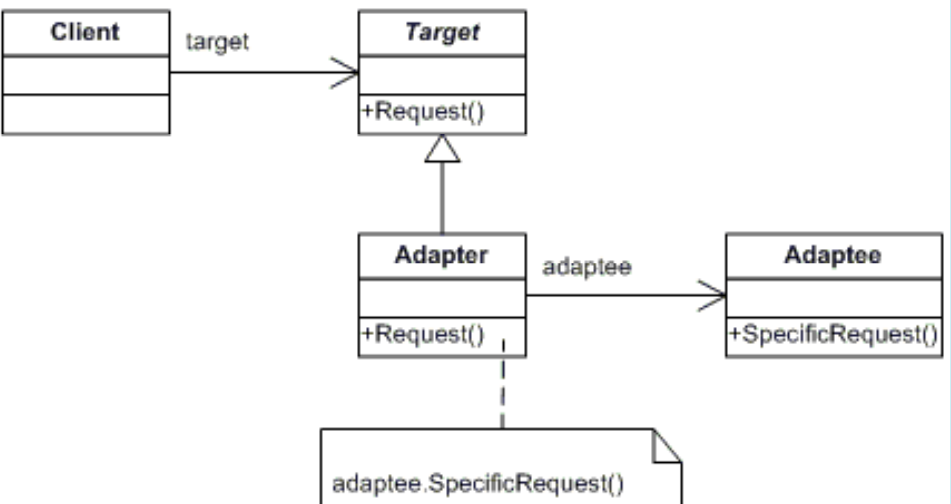

# ADAPTER

## Propósito:
É um padrão de projeto estrutural que permite objetos com interfaces incompatíveis colaborarem entre si.

## Intenção:
onverter a interface de uma classe em outra interface, esperada pelos clientes. O Adapter permite que classes com interfaces incompatíveis trabalhem em conjunto o que, de outra forma, seria impossível.
Equiparar interfaces de diferentes classes.

## Problema:
Vamos supor que temos uma aplicação que faz a comunicação com um determinado banco atravéz do XML. É realizado um novo contrato com uma sitema para analise e só usa JSON.
Você não pode usar o sistema de analise “como ela está” porque ela espera os dados em um formato que é incompatível com sua aplicação.

## Solução:
Você pode criar um adaptador. Ele é um objeto especial que converte a interface de um objeto para que outro objeto possa entendê-lo.
Por exemplo, você pode encobrir um objeto que opera em metros e quilômetros com um adaptador que converte todos os dados para unidades imperiais tais como pés e milhas.

É uma classe que é capaz de trabalhar tanto com o cliente quanto o serviço: ela implementa a interface do cliente enquanto encobre o objeto do serviço. O adaptador recebe chamadas do cliente através da interface do adaptador e as traduz para o serviço possa entender o objeto transformando para o serviço em um formato que ele possa entender.

## Aplicabilidade: 

Utilize a classe Adaptador quando você quer usar uma classe existente, mas sua interface não for compatível com o resto do seu código
O padrão Adapter permite que você crie uma classe de meio termo que serve como um tradutor entre seu código e a classe antiga, uma classe de terceiros, ou qualquer outra classe com uma interface estranha.

## Prós:
* Princípio de responsabilidade única. Você pode separar a conversão de interface ou de dados da lógica primária do negócio do programa.
* Princípio aberto/fechado. Você pode introduzir novos tipos de adaptadores no programa sem quebrar o código cliente existente, desde que eles trabalhem com os adaptadores através da interface cliente.

## Contras:
*A complexidade geral do código aumenta porque você precisa introduzir um conjunto de novas interfaces e classes. Algumas vezes é mais simples mudar a classe serviço para que ela se adeque com o resto do seu código.

## Como implementar:
Declare a interface cliente e descreva como o cliente se comunica com o serviço.
Cria a classe adaptadora e faça-a seguir a interface cliente. 
Implemente todos os métodos da interface cliente na classe adaptadora. O adaptador deve delegar a maioria do trabalho real para o objeto serviço, lidando apenas com a conversão da interface ou formato dos dados.
Os Clientes devem usar o adaptador através da interface cliente. Isso irá permitir que você mude ou estenda o adaptador sem afetar o código cliente.

## Relações com outros padrões

O __Bridge__ é geralmente definido com antecedência, permitindo que você desenvolva partes de uma aplicação independentemente umas das outras. Por outro lado, o __Adapter__ é comumente usado em aplicações existentes para fazer com que classes incompatíveis trabalhem bem juntas.

O __Adapter__ muda a interface de um objeto existente, enquanto que o __Decorator__ melhora um objeto sem mudar sua interface. Além disso, o Decorator suporta composição recursiva, o que não seria possível quando você usa o __Adapter__.

O __Adapter__ fornece uma interface diferente para um objeto encapsulado, o Proxy fornece a ele a mesma interface, e o __Decorator__ fornece a ele com uma interface melhorada.

O __Facade__ define uma nova interface para objetos existentes, enquanto que o __Adapter__ tenta fazer uma interface existente ser utilizável. O __Adapter__ geralmente envolve apenas um objeto, enquanto que o Facade trabalha com um inteiro subsistema de objetos.

O __Bridge__, __State__, __Strategy__ (e de certa forma o Adapter) têm estruturas muito parecidas. De fato, todos esses padrões estão baseados em composição, o que é delegar o trabalho para outros objetos. Contudo, eles todos resolvem problemas diferentes. Um padrão não é apenas uma receita para estruturar seu código de uma maneira específica. Ele também pode comunicar a outros desenvolvedores o problema que o padrão resolve.

