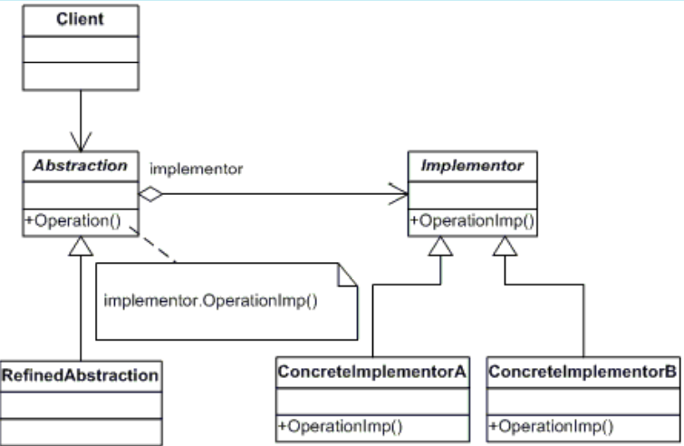

# BRIDGE
## Propósito:
Permite que você divida uma classe grande ou um conjunto de classes intimamente ligadas em duas hierarquias (separadas,abstração e implementação) que podem ser desenvolvidas independentemente umas das outras.
## Intenção:
Desacoplar uma abstração da sua implementação, de modo que as duas possam variar independentemente.
Separa a interface do objeto de sua implementação.
## Problema: 
Digamos que você tem uma classe _Forma_ geométrica com um par de subclasses: _Círculo_ e _Quadrado_. Você quer estender essa hierarquia de classe para incorporar __cores__, então você planeja criar as subclasses de forma _Vermelho_ e _Azul_. Contudo, já que você já tem duas subclasses, você precisa criar quatro combinações de classe tais como _CírculoAzul_ e _QuadradoVermelho_.

__Adicionar novos tipos de forma e cores à hierarquia irá fazê-la crescer exponencialmente.__

## Solução:
Precisamos trocar a herança para composição de objetos.
Ou seja precisamos de separar em mais classes, para ao invés de ter todos os estados e comportamentos dentro da mesma classe possamos referenciar um objeto da noba hierarquia.

Seguindo o exemplo do problema iriamos separar a classe _Forma_ e a classe _cor_.Agora criamos a classe forma com uma referencia para a classe cor, ela vai agir como uma ponte entre as duas classes. Podendo adicionar outras formas ou cores sem mprecisar crescer exponencialmente.

## Aplicabilidade: 

Quando você quer dividir e organizar uma classe monolítica que tem diversas variantes da mesma funcionalidade.Quanto maior a classe se torna, mais difícil é de entender como ela funciona, e mais tempo se leva para fazer mudanças. As mudanças feitas para uma das variações de funcionalidade podem precisar de mudanças feitas em toda a classe, o que quase sempre resulta em erros ou falha em lidar com efeitos colaterais.
O padrão Bridge permite que você divida uma classe monolítica em diversas hierarquias de classe. Após isso, você pode modificar as classes em cada hierarquia independentemente das classes nas outras. Essa abordagem simplifica a manutenção do código e minimiza o risco de quebrar o código existente.

Utilize o padrão quando você precisa estender uma classe em diversas dimensões independentes.Você extraia uma hierarquia de classe separada para cada uma das dimensões. A classe original delega o trabalho relacionado para os objetos pertencentes àquelas hierarquias ao invés de fazer tudo por conta própria.

## Prós:
* Você pode criar classes e aplicações independentes de plataforma.
* O código cliente trabalha com abstrações em alto nível. Ele não fica exposto a detalhes de plataforma.
* Princípio aberto/fechado. Você pode introduzir novas abstrações e implementações independentemente uma das outras.
* Princípio de responsabilidade única. Você pode focar na lógica de alto nível na abstração e em detalhes de plataforma na implementação.

## Contras:
* Você pode tornar o código mais complicado ao aplicar o padrão em uma classe altamente coesa.

## Como implementar:
Veja quais operações o cliente precisa e defina-as na classe abstração base.
Determine as operações disponíveis em todas as plataformas. Declare aquelas que a abstração precisa na interface geral de implementação.
Crie classes concretas de implementação para todas as plataformas de seu domínio, mas certifique-se que todas elas sigam a interface de implementação.
Dentro da classe de abstração, adicione um campo de referência para o tipo de implementação. A abstração delega a maior parte do trabalho para o objeto de implementação que foi referenciado neste campo.
O código cliente deve passar um objeto de implementação para o construtor da abstração para associar um com ou outro. Após isso, o cliente pode esquecer sobre a implementação e trabalhar apenas com o objeto de abstração.

## Relações com outros padrões
O __Bridge__ é geralmente definido com antecedência, permitindo que você desenvolva partes de uma aplicação independentemente umas das outras. Por outro lado, o __Adapter__ é comumente usado em aplicações existentes para fazer com que classes incompatíveis trabalhem bem juntas.

O __Bridge__, __State__, __Strategy__ (e de certa forma o __Adapter__) têm estruturas muito parecidas. De fato, todos esses padrões estão baseados em composição, o que é delegar o trabalho para outros objetos. Contudo, eles todos resolvem problemas diferentes. Um padrão não é apenas uma receita para estruturar seu código de uma maneira específica. Ele também pode comunicar a outros desenvolvedores o problema que o padrão resolve.

Você pode usar o __Abstract Factory__ junto com o __Bridge__. Esse pareamento é útil quando algumas abstrações definidas pelo __ridge__ só podem trabalhar com implementações específicas. Neste caso, o Abstract Factory pode encapsular essas relações e esconder a complexidade do código cliente.

Você pode combinar o __Builder__ com o __Bridge__: a classe diretor tem um papel de abstração, enquanto que diferentes construtores agem como implementações.