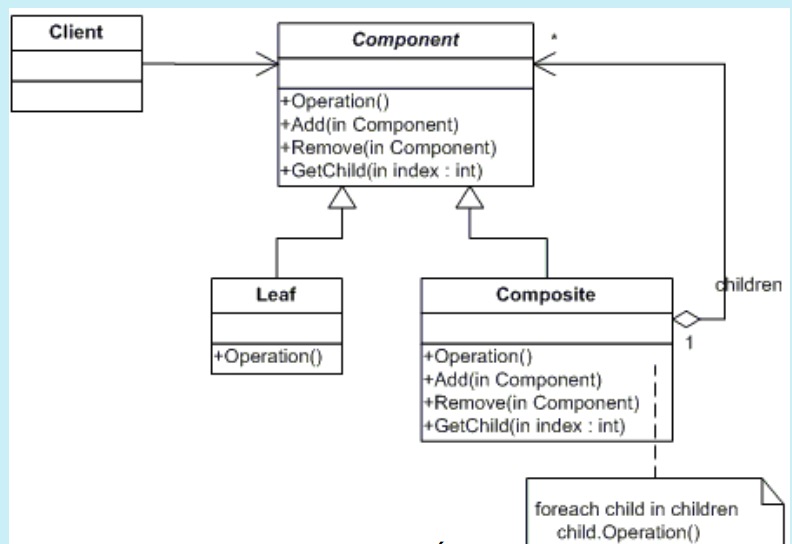

# COMPOSITE
## Propósito:
É um padrão de projeto estrutural que permite que você componha objetos em estruturas de árvores e então trabalhe com essas estruturas como se elas fossem objetos individuais.
## Intenção:
Compor objetos em estruturas de árvore para representarem hierarquias todo-parte.

## Problema:
Imagine que você tem dois tipos de objetos: _Produtos_ e _Caixas_. Uma _Caixa_ pode conter diversos _Produtos_ bem como um número de _Caixas_ menores. Essas _Caixas_ menores também podem ter alguns _Produtos_ ou até mesmo Caixas menores que elas, e assim em diante.Digamos que você decida criar um sistema de pedidos que usa essas classes. 
Para saber valor total do item precisamos conhecer as classes dos _Produtos_ e _Caixas_.

## Solução:
Trabalhe com _Produtos_ e _Caixas_ através de uma interface comum que declara um método para a contagem do preço total.
O padrão Composite permite que você rode um comportamento recursivamente sobre todos os componentes de uma árvore de objetos.
Você não precisa se preocupar sobre as classes concretas dos objetos que compõem essa árvore. Você não precisa saber se um objeto é um produto simples ou uma caixa sofisticada. Você pode tratar todos eles com a mesma interface. Quando você chama um método os próprios objetos passam o pedido pela árvore.

O código cliente trabalha com todas as formas através da interface única comum à todas as classes de forma. Portanto, o cliente não sabe se está trabalhando com uma forma simples ou composta. O cliente pode trabalhar com estruturas de objeto muito complexas sem ficar acoplado à classe concreta que formou aquela estrutura.

## Aplicabilidade: 
Utilize o padrão Composite quando você tem que implementar uma estrutura de objetos tipo árvore.
O padrão Composite fornece a você com dois tipos básicos de elementos que compartilham uma interface comum: folhas simples e contêineres complexos. Um contêiner pode ser composto tanto de folhas como por outros contêineres. Isso permite a você construir uma estrutura de objetos recursiva aninhada que se assemelha a uma árvore.

Utilize o padrão quando você quer que o código cliente trate tanto os objetos simples como os compostos de forma uniforme.
Todos os elementos definidos pelo padrão Composite compartilham uma interface comum. Usando essa interface o cliente não precisa se preocupar com a classe concreta dos objetos com os quais está trabalhando.

## Prós:
* Você pode trabalhar com estruturas de árvore complexas mais convenientemente: utilize o polimorfismo e a recursão a seu favor.
* Princípio aberto/fechado. Você pode introduzir novos tipos de elemento na aplicação sem quebrar o código existente, o que agora funciona com a árvore de objetos.

## Contras:
* Pode ser difícil providenciar uma interface comum para classes cuja funcionalidade difere muito. Em certos cenários, você precisaria generalizar muito a interface componente, fazendo dela uma interface de difícil compreensão.

## Como implementar:
Criar uma interface Componente descreve operações que são comuns tanto para elementos simples como para elementos complexos da árvore.
A Folha é um elemento básico de uma árvore que não tem sub-elementos.Geralmente, componentes folha acabam fazendo boa parte do verdadeiro trabalho, uma vez que não tem mais ninguém para delegá-lo.
O composite é o elemento que tem sub-elementos: folhas ou outros composite. Um composite não sabe a classe concreta de seus filhos. Ele trabalha com todos os sub-elementos apenas através da interface componente.
Ao receber um pedido, um composite delega o trabalho para seus sub-elementos, processa os resultados intermediários, e então retorna o resultado final para o cliente.
O Cliente trabalha com todos os elementos através da interface componente. Como resultado, o cliente pode trabalhar da mesma forma tanto com elementos simples como elementos complexos da árvore.
## Relações com outros padrões
O __Chain of Responsibility__ é frequentemente usado em conjunto com o __Composite__. Neste caso, quando um componente folha recebe um pedido, ele pode passá-lo através de uma corrente de todos os componentes pai até a raiz do objeto árvore.
Você pode usar __Iteradores__ para percorrer árvores __Composite__.
Você pode usar o __Visitor__ para executar uma operação sobre uma árvore __Composite__ inteira.
Você pode usar o __Builder__ quando criar árvores __Composite__ complexas porque você pode programar suas etapas de construção para trabalhar recursivamente.