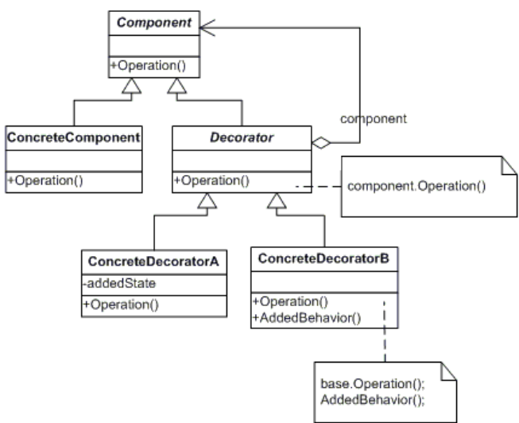

# DECORATOR
## Propósito:
Criar uma classe decoradora que envolve a classe original e adiciona novos comportamentos / operações a um objeto em tempo de execução, permitindo assim a expansão do objeto de maneira mais flexível.
## Intenção:
Agregar dinamicamente responsabilidades adicionais a um objeto.

## Problema: 
Quando criamos uma classe abstrata e criamos herança de objetos que podem derivar. 
Vamos supor que temos uma loja de café, onde servimos Expresso e MisturaDaCasa.Neste caso foi criado uma classe café onde tem uma função de valor. As classes Expresso e MisturaDaCasa herdam da classe café se eu quiser adicionar mais algo ao café expresso precisaria fazer outra herança.
## Solução:
Estender uma classe é a primeira coisa que vem à mente quando você precisa alterar o comportamento de um objeto. Contudo, a herança vem com algumas ressalvas sérias que você precisa estar ciente.
A herança é estática. Você não pode alterar o comportamento de um objeto existente durante o tempo de execução. Você só pode substituir todo o objeto por outro que foi criado de uma subclasse diferente.
As subclasses só podem ter uma classe pai. Na maioria das linguagens, a herança não permite que uma classe herde comportamentos de múltiplas classes ao mesmo tempo.

## Aplicabilidade: 
Utilize o padrão Decorator quando você precisa ser capaz de projetar comportamentos adicionais para objetos em tempo de execução sem quebrar o código que usa esses objetos.
O Decorator lhe permite estruturar sua lógica de negócio em camadas, criar um decorador para cada camada, e compor objetos com várias combinações dessa lógica durante a execução. O código cliente pode tratar de todos esses objetos da mesma forma, como todos seguem a mesma interface comum.

Utilize o padrão quando é complicado ou impossível estender o comportamento de um objeto usando herança.
Muitas linguagens de programação tem a palavra chave final que pode ser usada para prevenir a extensão de uma classe. Para uma classe final, a única maneira de reutilizar seu comportamento existente seria envolver a classe com seu próprio invólucro usando o padrão Decorator.

## Prós:
* Utilização de padrão faz com que o projeto adote uma linguagem universal facilitando ainda mais a compreensão do código por parte de outros developers;
* Você pode estender o comportamento de um objeto sem fazer um nova subclasse.
* Você pode adicionar ou remover responsabilidades de um objeto no momento da execução.
* Você pode combinar diversos comportamentos ao envolver o objeto com múltiplos decoradores.
* Princípio de responsabilidade única. Você pode dividir uma classe monolítica que implementa muitas possíveis variantes de um comportamento em diversas classes menores.
* Permite que as classes de componente concreto continuem simples movendo o embelezamento (novas funcionalidades) para classes decoradoras.

## Contras:
* É difícil remover um invólucro de uma pilha de invólucros.
* É difícil implementar um decorador de tal maneira que seu comportamento não dependa da ordem do pilha de decoradores.
* A configuração inicial do código de camadas pode ficar bastante feia.
* Pode diminuir a eficiência do projeto caso muitas classes decoradoras forem necessárias para um componente abstrato com muitos métodos públicos (lembrando que classes decoradoras têm que ter a mesma interface pública que classes componente concreto).

## Como implementar:
Certifique-se que seu domínio de negócio pode ser representado como um componente primário com múltiplas camadas opcionais sobre ele.
Descubra quais métodos são comuns tanto para o componente primário e para as camadas opcionais. Crie uma interface componente e declare aqueles métodos ali.
Crie uma classe componente concreta e defina o comportamento base nela.
Crie uma classe decorador base. Ela deve ter um campo para armazenar uma referência ao objeto envolvido. O campo deve ser declarado com o tipo da interface componente para permitir uma ligação entre os componentes concretos e decoradores. O decorador base deve delegar todo o trabalho para o objeto envolvido.
Certifique-se que todas as classes implementam a interface componente.
Crie decoradores concretos estendendo-os a partir do decorador base. Um decorador concreto deve executar seu comportamento antes ou depois da chamada para o método pai (que sempre delega para o objeto envolvido).
O código cliente deve ser responsável por criar decoradores e compô-los do jeito que o cliente precisa.

## Relações com outros padrões

O __Adapter__ fornece uma interface diferente para um objeto encapsulado, o __Proxy__ fornece a ele a mesma interface, e o __Decorator__ fornece a ele com uma interface melhorada.
O __Adapter__ muda a interface de um objeto existente, enquanto que o __Decorator__ melhora um objeto sem mudar sua interface. Além disso, o __Decorator__ suporta composição recursiva, o que não seria possível quando você usa o __Adapter__.
O __Decorator__ permite que você mude a pele de um objeto, enquanto o __Strategy__ permite que você mude suas entranhas.