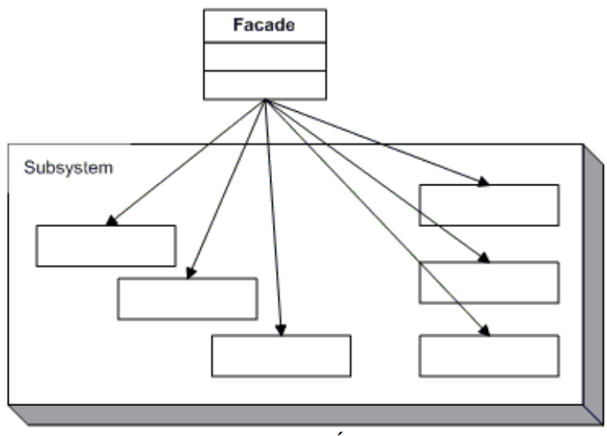

# FACADE
## Propósito:
Fornece uma interface simplificada para uma biblioteca, um framework, ou qualquer conjunto complexo de classes.

## Intenção:
Fornecer uma interface unificada para um conjunto de interfaces em um subsistema. Façade define uma interface de nível mais alto que torna o subsistema mais fácil de ser usado.
Uma única classe representa um subsistema inteiro.
## Problema: 
Imagine que você precisa fazer seu código funcionar com um amplo conjunto de objetos que pertencem a uma sofisticada biblioteca ou framework. Normalmente, você precisaria inicializar todos aqueles objetos, rastrear as dependências, executar métodos na ordem correta, e assim por diante.
Como resultado, a lógica de negócio de suas classes vai ficar firmemente acoplada aos detalhes de implementação das classes de terceiros, tornando difícil compreendê-lo e mantê-lo.

## Solução:
Uma fachada é uma classe que fornece uma interface simples para um subsistema complexo que contém muitas partes que se movem. Uma fachada pode fornecer funcionalidades limitadas em comparação com trabalhar com os subsistemas diretamente. Contudo, ela inclui apenas aquelas funcionalidades que o cliente se importa.
Ter uma fachada é útil quando você precisa integrar sua aplicação com uma biblioteca sofisticada que tem dúzias de funcionalidades, mas você precisa de apenas um pouquinho delas.

## Aplicabilidade: 
Usado quando um sistema é muito complexo ou difícil de entender porque o sistema tem um grande número de classes interdependentes ou seu código-fonte não está disponível

Utilize o padrão Facade quando você precisa ter uma interface limitada mas simples para um subsistema complexo.
Com o passar do tempo, subsistemas ficam mais complexos. Até mesmo aplicar padrões de projeto tipicamente leva a criação de mais classes. Um subsistema pode tornar-se mais flexível e mais fácil de se reutilizar em vários contextos, mas a quantidade de códigos padrão e de configuração que ele necessita de um cliente cresce cada vez mais. O Facade tenta consertar esse problema fornecendo um atalho para as funcionalidades mais usadas do subsistema que corresponde aos requerimentos do cliente.

Utilize o Facade quando você quer estruturar um subsistema em camadas.
Crie fachadas para definir pontos de entrada para cada nível de um subsistema. Você pode reduzir o acoplamento entre múltiplos subsistemas fazendo com que eles se comuniquem apenas através de fachadas.

## Prós:
* Você pode isolar seu código da complexidade de um subsistema.

## Contras:
* Uma fachada pode se tornar um objeto essencial acoplado a todas as classes de uma aplicação.As abstrações e implementações de um subsistema são fortemente acopladas.

## Como implementar:
Verifique se é possível providenciar uma interface mais simples que a que o subsistema já fornece. Você está no caminho certo se essa interface faz o código cliente independente de muitas classes do subsistema.
Declare e implemente essa interface em uma nova classe fachada. A fachada deve redirecionar as chamadas do código cliente para os objetos apropriados do subsistema. A fachada deve ser responsável por inicializar o subsistema e gerenciar seu ciclo de vida a menos que o código cliente já faça isso.
Para obter o benefício pleno do padrão, faça todo o código cliente se comunicar com o subsistema apenas através da fachada. Agora o código cliente fica protegido de qualquer mudança no código do subsistema. Por exemplo, quando um subsistema recebe um upgrade para uma nova versão, você só precisa modificar o código na fachada.
Se a fachada ficar grande demais, considere extrair parte de seu comportamento para uma nova e refinada classe fachada.

