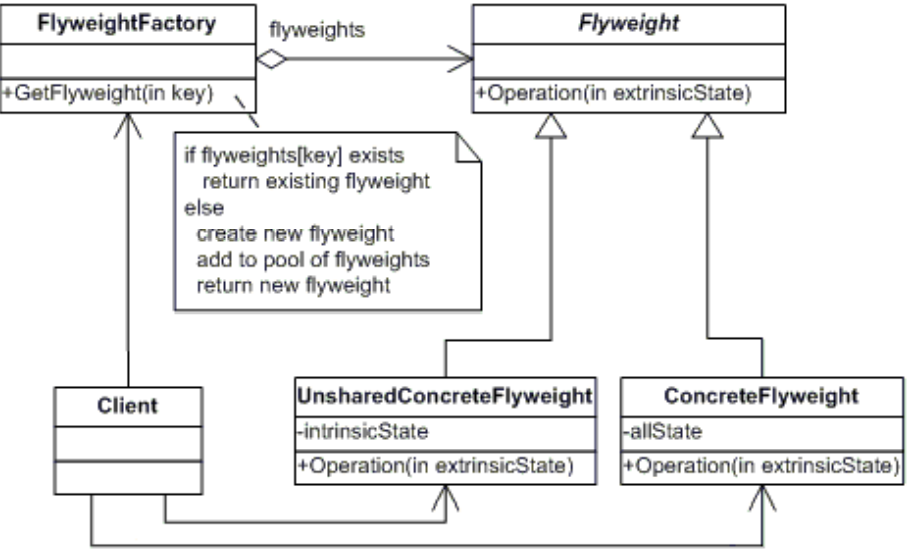

# FLYWEIGHT
## Propósito:
É usado para reduzir o número de objetos criados, para diminuir o uso de memória e recursos. Como resultado, aumenta o desempenho.
Tenta reutilizar objetos de tipo semelhantes já existentes, armazenando-os e cria um novo objeto quando nenhum objeto correspondente é encontrado.
## Intenção:
Usar compartilhamento para suportar eficientemente grandes quantidades de objetos de granularidade fina.

## Problema: 
Você escolhe implementar um sistema de partículas realístico e faz dele uma funcionalidade distinta do jogo. Uma grande quantidades de balas, mísseis, e estilhaços de explosões devem voar por todo o mapa e entregar adrenalina para o jogador.
Cada partícula, tais como uma bala, um míssil, ou um estilhaço era representado por um objeto separado contendo muita informação. Em algum momento, quando a destruição na tela do jogadora era tanta, as novas partículas criadas não cabiam mais no RAM restante, então o programa quebrava.

## Solução:
Somente o estado intrínseco fica dentro do objeto, permitindo que você o reutilize em diferentes contextos. Como resultado, você vai precisar de menos desses objetos uma vez que eles diferem apenas em seu estado intrínseco, que tem menos variações que o extrínseco.
Assumindo que extraímos o estado extrínseco de nossa classe de partículas, somente três diferentes objetos serão suficientes para representar todas as partículas no jogo: uma bala, um míssil, e um pedaço de estilhaço.

## Aplicabilidade: 
Usado quando há necessidade de criar um grande número de objetos de natureza quase semelhante e o custo de armazenamento é alto.
O benefício de aplicar o padrão depende muito de como e onde ele é usado. Ele é mais útil quando:
* Uma aplicação precisa gerar um grande número de objetos similares
* Isso drena a RAM disponível no dispositivo alvo
* Os objetos contém estados duplicados que podem ser extraídos e compartilhados entre múltiplos objetos

## Prós:
* Você pode economizar muita RAM, desde que seu programa tenha muitos objetos similares.

## Contras:
* Você pode estar trocando RAM por ciclos de CPU quando parte dos dados de contexto precisa ser recalculado cada vez que alguém chama um método flyweight.
* O código fica muito mais complicado. Novos membros de equipe sempre se perguntarão por que o estado de uma entidade foi separado de tal forma.

## Como implementar:
Divida os campos de uma classe que irá se tornar um flyweight em duas partes:
   * o estado intrínseco: os campos que contém dados imutáveis e duplicados para muitos objetos
   * o estado extrínseco: os campos que contém dados contextuais únicos para cada objeto
Deixe os campos que representam o estado intrínseco dentro da classe, mas certifique-se que eles sejam imutáveis. Eles só podem obter seus valores iniciais dentro do construtor.
Examine os métodos que usam os campos do estado extrínseco. Para cada campo usado no método, introduza um novo parâmetro e use-o ao invés do campo.
Opcionalmente, crie uma classe fábrica para gerenciar o conjunto de flyweights. Ela deve checar por um flyweight existente antes de criar um novo. Uma vez que a fábrica está rodando, os clientes devem pedir flyweights apenas através dela. Eles devem descrever o flyweight desejado ao passar o estado intrínseco para a fábrica.
O cliente deve armazenar ou calcular valores para o estado extrínseco (contexto) para ser capaz de chamar métodos de objetos flyweight. Por conveniência, o estado extrínseco junto com o campo de referência flyweight podem ser movidos para uma classe de contexto separada.
## Relações com outros padrões
Você pode implementar nós folha compartilhados da árvore __Composite__ como __Flyweights__ para salvar RAM.

No exemplo foi usado o package Newtonsoft. Para a instalação ultilize : dotnet add package Newtonsoft.Json --version 12.0.3
