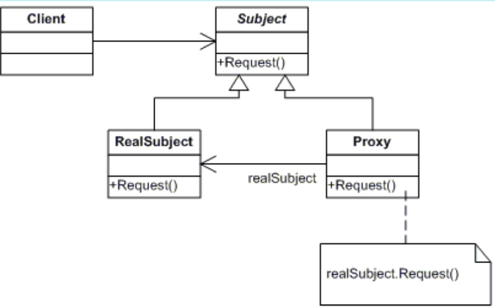

# PROXY
## Propósito:
Permite que você forneça um substituto ou um espaço reservado para outro objeto. Um proxy controla o acesso ao objeto original, permitindo que você faça algo ou antes ou depois do pedido chegar ao objeto original.
Existem vários tipos de proxies, alguns deles são os seguintes:

 * __Proxies virtuais:__  entrega a criação de um objeto a outro objeto
 * __Proxies de autenticação:__  verifica as permissões de acesso para uma solicitação
 * __Proxies remotos:__  codifica solicitações e as envia pela rede
 * __Proxies inteligentes:__  solicitações de mudança antes de enviá-las pela rede

## Intenção:
Fornece um substituto (surrogate) ou marcador da localização de outro objeto para controlar o acesso ao mesmo.
Um objeto representando um outro objeto

## Problema: 
Tem um objeto grande que consome muitos recursos do sistema. Você precisa dele de tempos em tempos, mas não sempre.Sendo assim as solicitações para bases de dados podem ser bem lentas.
## Solução:
O proxy se disfarça de objeto de base de dados. Ele pode lidar com inicializações preguiçosas e caches de resultados sem que o cliente ou a base de dados fiquem sabendo.
Permite que você faça isso sem mudar aquela classe. Uma vez que o proxy implementa a mesma interface que a classe original, ele pode ser passado para qualquer cliente que espera um objeto do serviço real.
## Aplicabilidade: 
Usado para fornecer um objeto substituto, que faz referência a outros objeto

Inicialização preguiçosa (proxy virtual). Este é quando você tem um objeto do serviço peso-pesado que gasta recursos do sistema por estar sempre rodando, mesmo quando você precisa dele de tempos em tempos.
 Ao invés de criar um objeto quando a aplicação inicializa, você pode atrasar a inicialização do objeto para um momento que ele é realmente necessário.
Controle de acesso (proxy de proteção). Este é quando você quer que apenas clientes específicos usem o objeto do serviço; por exemplo, quando seus objetos são partes cruciais de um sistema operacional e os clientes são várias aplicações iniciadas (incluindo algumas maliciosas).
 O proxy pode passar o pedido para o objeto de serviço somente se as credenciais do cliente coincidem com certos critérios.
Execução local de um serviço remoto (proxy remoto). Este é quando o objeto do serviço está localizado em um servidor remoto.
 Neste caso, o proxy passa o pedido do cliente pela rede, lidando com todos os detalhes sujos pertinentes a se trabalhar com a rede.
Registros de pedidos (proxy de registro). Este é quando você quer manter um histórico de pedidos ao objeto do serviço.
 O proxy pode fazer o registro de cada pedido antes de passar ao serviço.
Cache de resultados de pedidos (proxy de cache). Este é quando você precisa colocar em cache os resultados de pedidos do cliente e gerenciar o ciclo de vida deste cache, especialmente se os resultados são muito grandes.
 O proxy pode implementar o armazenamento em cache para pedidos recorrentes que sempre acabam nos mesmos resultados. O proxy pode usar como parâmetros dos pedidos as chaves de cache.
Referência inteligente. Este é para quando você precisa ser capaz de se livrar de um objeto peso-pesado assim que não há mais clientes que o usam.
 O proxy pode manter um registro de clientes que obtiveram uma referência ao objeto serviço ou seus resultados. De tempos em tempos, o proxy pode verificar com os clientes se eles ainda estão ativos. Se a lista cliente ficar vazia, o proxy pode remover o objeto serviço e liberar os recursos de sistema que ficaram empatados.
 O proxy pode também fiscalizar se o cliente modificou o objeto do serviço. Então os objetos sem mudança podem ser reutilizados por outros clientes.

## Prós:
* Você pode controlar o objeto do serviço sem os clientes ficarem sabendo.
* Você pode gerenciar o ciclo de vida de um objeto do serviço quando os clientes não se importam mais com ele.
* O proxy trabalha até mesmo se o objeto do serviço ainda não está pronto ou disponível.
* Princípio aberto/fechado. Você pode introduzir novos proxies sem mudar o serviço ou clientes.

## Contras:
* O código pode ficar mais complicado uma vez que você precisa introduzir uma série de novas classes.
* A resposta de um serviço pode ter atrasos.

## Como implementar:
Se não há uma interface do serviço pré existente, crie uma para fazer os objetos proxy e serviço intercomunicáveis. Extrair a interface da classe serviço nem sempre é possível, porque você precisaria mudar todos os clientes do serviço para usar aquela interface. O plano B é fazer do proxy uma subclasse da classe serviço e, dessa forma, ele herdará a interface do serviço.
Crie a classe proxy. Ela deve ter um campo para armazenar uma referência ao serviço. Geralmente proxies criam e gerenciam todo o ciclo de vida de seus serviços. Em raras ocasiões, um serviço é passado ao proxy através do construtor pelo cliente.
Implemente os métodos proxy de acordo com o propósito deles. Na maioria dos casos, após realizar algum trabalho, o proxy deve delegar o trabalho para o objeto do serviço.
Considere introduzir um método de criação que decide se o cliente obtém um proxy ou serviço real. Isso pode ser um simples método estático na classe do proxy ou um método factory todo implementado.
Considere implementar uma inicialização preguiçosa para o objeto do serviço.

