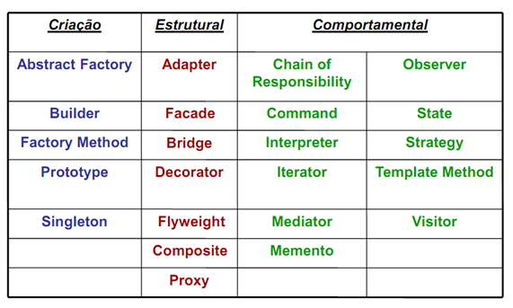

# PADRÕES DE PROJETOS "GOF"

## O que são Design Patterns?

Primeiramente é a tradução em inglês para Padrões de Projetos.

São soluções para resolver problemas em comum em um projeto, ou seja uma planta ja fabricada conveniente que podemos customizar, combinar para resolver um problema no software.O padrão é um conceito geral para resolver um problema em particular não é um pedaço de código.

Os padrões são frequentemente confundidos com algoritmos.Os algoritimos sempre define um conjunto claro de ações para atingir um objetivo, ja os padrões são descrições, passosde como resolver o problema para solução.

Podemos comparar os padrões de projetos como plantas de obras, elas são feitas para ser ultilizadas em determinado terreno, os padrões de projetos foram feitos para ser aplicados em determinados problemas.

Com o Design Pattern você terá vários benefícios dentre eles são: código mais enxuto, limpo, organizado, aumentar a qualidade e diminuir a complexidade do seu código. Mesmo nunca tendo encontrado esses problemas, saber sobre os padrões é  muito útil porque eles ensinam como resolver vários problemas idependente da linguagem que estiver ultilizando, é parecido com a [história do parafuso correto](http://www.audiorama.com.br/arquivoconfidencial/ESPECIALISTA.htm).

Os padrões de projetos começaram a serem mais difundidos e reconhecidos por volta de 1990 .

Algumas definições comuns:
    
    “Design Patterns são repetidas soluções para problemas de projetos que você está sempre se deparando” (Smaltalk);

    “Design Patterns é constituído por um conjunto de regras que descrevem como fazer certas tarefas no conceito de desenvolvimento de aplicações” (Pree 1994);

Design Patterns descreve uma solução ou uma instância da solução que foi utilizada para resolver um problema específico, sendo assim eles podem ser vistos como uma solução que já foi testada para problemas que alguém um dia teve e resolveu aplicando um modelo que foi documentado e que você pode adaptar integralmente ou de acordo com a necessidade de sua solução.

Em 1995 um grupo de pessoas, mas especificamente quatro pessoas escreveram um livro iniciando os Design Patterns mais conhecido de mercado, são eles Erich Gamma, Richard Helm, Ralph Johnson e John Vlissides. Eles foram conhecidos como Gang of four ou GOF.

Além do Design Pattern do GOF, existem vários outros patterns como, por exemplo, Connected Buildings, Car Connection, Positive Outdoor Space e vários outros, esses patters somam certa de 125 padrões.

Alguns padrões não tratam somente da comunicação mas também das estratégias de orientação a objeto,(Interações, modo de comunicação, forma de reutilização) isso faz com que eles sejam de grande importância.

Dentre os principais benefícios para que a utilização dos padrões de projetos seja justificado estão:

* Fornecem soluções que já foram testadas e aprovadas.
* Tornam o sistema mais fácil de entender e manter.
* Facilitam o desenvolvimento de módulos coesos.
* A comunicação entre os integrantes do projeto fica mais eficiente.

##### As principais propriedades dos padrões de projetos:
* Capturam o conhecimento e a experiência de especialistas em projeto de software.
* Especificam abstrações que estão acima do nível de classes ou objetos isolados ou de componentes.
* Definem um vocabulário comum para discussão de problemas e soluções de projetos.
* Facilitam a documentação e manutenção da arquitetura de software.
* Auxiliam o projeto de uma arquitetura com determinadas propriedades.
* Auxiliam o projeto de arquitetura mais complexas.

##### O Design Patterns do GOF possui um formato, são eles:

* Nome: Uma identificação para o patterns;
* Objetivo / Intenção: Também conhecido como (Also Known As);
* Motivação / Problema: Um cenário mostrando o problema e a necessidade;
* Aplicabilidade / Solução: Como identificar as situações nas quais os padrões é aplicável, descreve a solução proposta;
* Estrutura: Uma representação gráfica da estrutura das classes usando um diagrama de classes (UML);
* Consequências: Vantagens e desvantagem;
* Implementações: Quais detalhes devemos nos preocupar quando implementamos o padrão. Detalhes de cada linguagem;
* Usos conhecidos;
* Padrões Relacionados.

Os Designs Patterns do GOF são classificados em três categorias: Criação, Estrutural e Comportamental.
* Os __padrões criacionais__ fornecem mecanismos de criação de objetos que aumentam a flexibilidade e a reutilização de código.
* Os __padrões estruturais__ explicam como montar objetos e classes em estruturas maiores, enquanto ainda mantém as estruturas flexíveis e eficientes.
* Os __padrões comportamentais__ cuidam da comunicação eficiente e da assinalação de responsabilidades entre objetos.

##### Requisitos de um sistema de padrões:
* O sistema deve conter uma boa quantidade de padrões
* A descrição do padrão deve seguir um formato padronizado
* O sistema deve ser estruturado e organizado de acordo com os padrões e seguindo o critérios bem definidos
* O sistema deve mostrar o relacionamento entre os padrões.
* O sistema deve estar estruturado de modo que possa evoluir

Mas lembre-se que os padrões de projetos não são uma varinha mágica que vai tornar o seu projeto isento de falhas. Se for mal implementado eles podem até diminuir a compreensão do seu projeto e aumentar a quantidade de código. Portanto padrões de projetos não resolvem todos os problemas de design patterns.Não adianta sair implementando sem uso justificável, pois seria bater martelo em um parafuso tornando a sulução ineficiente. Acontece com muitos que acabaram de se familiarizar com os padrões, tentam aplicá-los em tudo, até mesmo em situações onde um código mais simples seria suficiente.

# Navegue entre eles

## [Criacional](PadroesCriacionais\README.MD)

### [Singleton](PadroesCriacionais\Singleton\README.MD)
Assegura que somente um objeto de uma determinada classe seja criado em todo o projeto;
### [Abstract Factory](PadroesCriacionais\AbstractFactory\README.md)
Permite que um cliente crie famílias de objetos sem especificar suas classes concretas;
### [Builder](PadroesCriacionais\Builder\README.MD)
Encapsular a construção de um produto e permitir que ele seja construído em etapas;
### [Prototype](PadroesCriacionais\Prototype\README.MD)
Permite você criar novas instancias simplesmente copiando instancias existentes;
### [Factory Mathod](PadroesCriacionais\FactoryMethod\README.MD)
As subclasses decidem quais classes concretas serão criadas;

## [Estruturais](PadroesEstruturais\README.MD)

### [Decorator](PadroesEstruturais\Decorator\README.MD)
Envelopa um objeto para fornecer novos comportamentos;
### [Proxy](PadroesEstruturais\Proxy)
Envelopa um objeto para controlar o acesso a ele;
### [FlyWeigth](PadroesEstruturais\Flyweight\README.md)
Uma instancia de uma classe pode ser usada para fornecer muitas “instancias virtuais”;
### [Facade](PadroesEstruturais\Facade\README.MD)
Simplifica a interface de um conjunto de classes;
### [Composite](PadroesEstruturais\Composite\README.MD)
Os clientes tratam as coleções de objetos e os objetos individuais de maneira uniforme;
### [Bridge](PadroesEstruturais\Bridge\README.MD)
Permite criar uma ponte para variar não apenas a sua implementação, como também as suas abstrações;
### [Adapter](PadroesEstruturais\Adapter\README.MD)
Envelopa um objeto e fornece a ele uma interface diferente;

## [Comportamental](PadroesComportamentais\README.MD)

### [Template Method](PadroesComportamentais\TemplateMethod\README.MD)
As subclasses decidem como implementar os passos de um algoritimo;
### [Visitor](PadroesComportamentais\Visitor\README.MD)
Permite acrescentar novos recursos a um composto de objetos e o encapsulamento não é importante;
### [Command](PadroesComportamentais\Command\README.MD)
Encapsula uma solicitação como um objeto;
### [Strategy](PadroesComportamentais\Strategy\README.MD)
Encapsula comportamentos intercambiáveis e usa a delegação para decidir qual deles será usado;
### [Chair of Responsability](PadroesComportamentais\ChainOfResponsibility\README.MD)
Permite dar a mais de um objeto a oportunidade de processar uma solicitação;
### [Iterator](PadroesComportamentais\Iterator\README.MD)
Fornece uma maneira de acessar seqüencialmente uma coleção de objetos sem expor a sua implementação;
### [Mediator](PadroesComportamentais\Mediator\README.MD)
Centraliza operações complexas de comunicação e controle entre objetos relacionados;
### [Memento](PadroesComportamentais\Memento\README.MD)
Permite restaurar um objeto a um dos seus estados prévios, por exemplo, quando o usuário seleciona um “desfazer”;
### [Interpreter](PadroesComportamentais\Interpreter\README.MD)
Permite construir um intérprete para uma linguagem;
### [State](PadroesComportamentais\State\README.MD)
Encapsula comportamentos baseados em estados e usa a delegação para alternar comportamentos;
### [Observer](PadroesComportamentais\Observer\README.MD)
Permite notificar outros objetos quando ocorre uma mudança de estado.